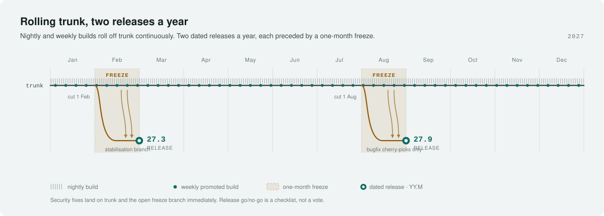

# Decision Log
Status: **draft for comment.**

The authoritative record.

In the table, one line per decision, with what it costs us.

More details listed in a sub-section below.

| ID | Decision | Date | Status |
|---|---|---|---|
| D1 | Clean break from Haiku; cherry-pick relevant commits | 2026-09-01 | **Proposed** |
| D2 | Keep hpkg/packagefs; rename system packages, `provides: haiku` | 2026-09-01 | Open — needs owner |
| D3 | MIT only, unless already used in the Haiku codebase | 2026-09-01 | Decided |
| D4 | Tier 1 x86/x86_64; Tier 2 RISC-V/ARM; Tier 3 SPARC/PPC/other | 2026-09-01 | **Proposed** |
| D5 | Rolling nightly + weekly builds; 2 releases/year, 1-month freeze | 2026-09-01 | **Proposed** |
| D6 | CI gating from day 1, before the repo opens for pull requests | 2026-09-01 | **Proposed** |

---

## D1 — Clean break, cherry-pick relevant commits  *(proposed)*

Haiku is not upstream in the GNU sense. The two projects run side by side, and code moves
one way, per commit, on merit.

- Fork with **complete history**. Never squash-import: `git blame` and MIT attribution both
  depend on it.
- A `vendor/haiku` branch mirrors upstream verbatim and is **never merged into trunk**.
- Every import is `git cherry-pick -x`, which records the source commit permanently.
- A weekly job classifies new upstream commits by whether they touch files we have diverged
  on: untouched → import candidate, diverged → human review, replaced subsystem → ignore.
  The routing is computed from the diff; a model writes the summary and risk note only.
- `UPSTREAM.md` is the ledger: imported, declined, and why.

**Cost:** one person's attention for an hour a week, indefinitely.

## D2 — Package identity *(not yet decided — needs an owner)*

Kept in the log because it blocks the first ISO and nobody owns it yet.

- Keep hpkg and packagefs. The format is the strongest idea in the design; the reported
  breakage was dependency solving across base-system versions.
- Rename the system set (`renku`, `renku_devel`, `renku_x86`) and declare
  `provides: haiku = <version>` so existing third-party packages resolve unmodified.
- Ship **no** Haiku repository in the default configuration. This is what stops
  `pkgman update` overwriting replaced system components, at the root rather than by
  block-listing.
- Do not build anything on the `system_package` flag — it is unused upstream and can be
  removed without notice.
- Own and sign the repository; keep mirroring a plain file copy.

## D3 — MIT only, unless already used  *(decided)*

- New code written for RenkuOS is MIT.
- **Any non-MIT licence already used in the Haiku codebase stays as it is.** We are not
  relicensing what we inherit, and inherited code is exempt from the MIT requirement.
- Anything else non-MIT needs a stated reason and a council decision, per-case — not a
  general policy change.

Two mechanics that make this checkable at review time rather than after release:

- An SPDX identifier in every file, enforced by CI.
- `Ported-from:` and `Ported-from-license:` trailers on any code taken from another project
  (see [`REVIEW.md`](REVIEW.md) §1.3). This is where a licence question gets caught.

If a copyleft exception is ever granted, that code lands as a **loadable kernel add-on in its
own package, never statically linked into the core image** — linking GPL code into the kernel
would make the shipped kernel binary GPL-only.

**Open, and it will come up at the first driver import:** does "MIT" mean MIT strictly, or
MIT-compatible permissive? A strict reading blocks BSD and ISC drivers from FreeBSD and
OpenBSD, which is the richest source of hardware support available to us.

## D4 — Architecture tiers  *(proposed)*

| Tier | Targets | CI requirement | Blocks merge | Blocks release |
|---|---|---|---|---|
| 1 | x86, x86_64 | Full build, boot, test suite | Yes | Yes |
| 2 | RISC-V, ARM | Build and boot under emulation | Build breaks only | No |
| 3 | SPARC, PowerPC, other niche | Build attempted; may fail | No | No |

- Tier 2 exists **to become Tier 1.** Promotion needs a named maintainer, CI able to reach
  the target, and two releases of clean Tier 2 history.
- Tier 3 promotes on the same terms whenever enough interested developers show up to
  maintain it. The tier is a statement about maintainer capacity, not about the
  architecture's worth.
- A Tier 1 break blocks the merge queue. A Tier 3 break blocks nobody.
- **x86 here means 32-bit x86 on a modern toolchain. gcc2 is not revived and is not a
  tier.** BeOS binary compatibility, if ever wanted, becomes a separate subsystem project
  rather than a constraint on the whole tree.

**Cost, stated plainly:** two Tier 1 targets roughly doubles the per-PR build budget, every
port in the repository must build twice, and mirror space doubles. Practical mitigation if
CI time becomes the bottleneck: build both per-PR, run the full test suite on x86_64
per-PR and on x86 nightly.

**Benefit worth naming:** a 32-bit Tier 1 catches pointer truncation and 64-bit-only
assumptions at review time. That is among the most common defect classes in generated
systems code, so this choice pays part of D6's bill.

## D5 — Rolling trunk, two releases a year  *(proposed)*

- **Nightly** builds from trunk — bleeding edge.
- **Weekly** promoted build — what most users should run day to day.
- **Two releases a year**, each preceded by a **one-month freeze**: cut a stabilisation
  branch, take bugfix cherry-picks only, then release. Security fixes go to trunk and the
  branch immediately.
- Versioning is `YY.M`. No codenames.
- A publishable calendar falls straight out of it: cut 1 Feb → release `27.3`;
  cut 1 Aug → release `27.9`.
- Release go/no-go is a **checklist, not a vote**: Tier 1 CI green, no open data-loss bug,
  installer completes on the hardware lab, release notes written. A checklist can be run by
  someone other than the project lead, which is the actual goal.

## D6 — CI from day 1  *(proposed)*

The gate exists before the repository accepts its first pull request. Detail in
[`engineering-charter.md`](engineering-charter.md) §3; the short version is that accepting machine-assisted
contributions without automated verification is the one combination this project cannot
survive.
