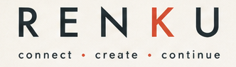
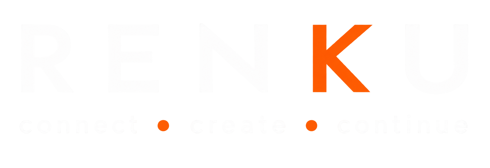
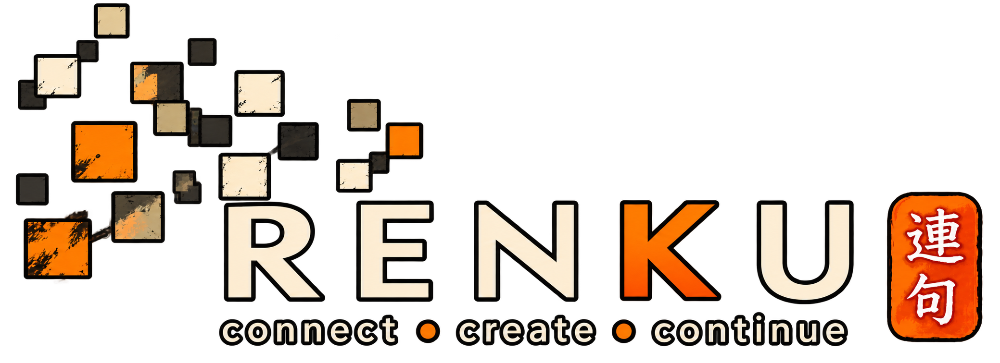

<!-- ahoy -->

# Proposal: the communications document set

Status: **draft for discussion, not a document set yet, a proposal for one.**

This file exists to be argued with and then deleted. It proposes what the communications
side of the project should commit to writing down, why each piece earns its place, and what
it costs. Nothing here is written yet. If the shape is wrong, it is much cheaper to say so
now than after four more files exist.

Companion documents:
[`DECISIONS.md`](DECISIONS.md),
[`REVIEW.md`](REVIEW.md),
[`CONTRIBUTING.md`](CONTRIBUTING.md),
[`engineering-charter.md`](engineering-charter.md).

`SECURITY.md` is referenced below (§3.5) but is not yet written; the repository's `README.md`
already lists it as needed before the first public ISO. It becomes a fifth companion once it
exists. Nothing here should be read as claiming it exists now.

---

## 0. The scope change this asks for

Every document in this repository currently opens with a version of the same line:

> Out of scope here: naming, branding, visual identity, and the non-profit's formation.

That was the right call when the engineering documents were being drafted: it kept a
long thread from turning into a logo argument. It has since become inaccurate. Three logo
revisions are committed to `assets/`, the project has a name it uses consistently, and the
first thing a stranger will meet is not `REVIEW.md` §9.

**The proposal is to widen the repository's stated scope** from *how we build, decide, and
merge* to *how we build, decide, merge, and talk about it*, and to say so in
[`README.md`](README.md) rather than leaving four documents disclaiming a subject the
repository already contains.

The non-profit's formation stays out of scope. That is a legal matter with its own venue,
though it resurfaces once, as a flagged dependency rather than a decision, in §4.6's
question of who may use the RenkuOS name.

**Cost of the change:** one line edited in each of four documents, and the communications
set becomes something a reviewer can block on. That second part is the point.

---

## 1. Why this is a risk register, not a marketing plan

A marketing plan for a project with no ISO, no maintainers named, and a decision log where
most entries are still marked **Proposed** and one is explicitly waiting on an owner would
be fiction. This proposes something narrower and more useful.

The project's actual communications exposure is specific and already present:

1. **It was founded on a disagreement with an existing project, and it will be judged on how
   it presents itself more broadly, not only the Haiku framing.** Every sentence written
   about why RenkuOS exists is read by people in Haiku, and some of it will be quoted back
   without its context. There is no version of this where the framing does not matter.
2. **Its defining policy is the internet's most reliably inflammatory subject.** "Machine-
   assisted contributions are welcome" is a position that attracts an argument the project
   did not choose and cannot win by re-litigating. [`REVIEW.md`](REVIEW.md) §0 already
   settles it internally with unusual clarity; nothing translates that outward.
3. **It will be judged on its first ISO, by people who did not read the phase plan.** The
   charter is honest that Phase 1 merges are "simultaneously the first merge candidates and
   the most dangerous ones". A public expectation set above that reality is how a new
   project earns a reputation it then spends two years shedding.
4. **Nobody currently owns what the project says.** [`DECISIONS.md`](DECISIONS.md) names an
   owner gap for D2 and treats it as blocking. The same gap exists for external
   communication and is not written down anywhere.

Every document below exists to close one of those four. `BRAND.md` is the one exception, and
it is deliberate rather than a gap: it closes risk 1 (how the project presents itself to
strangers and to Haiku) from the visual-identity side, the same way `COMMUNICATIONS.md`
closes it from the language side. If a proposed document cannot be traced back to one of the
four, it should not be written.

---

## 2. What is proposed, in priority order

Four documents. Two matter now; two can wait for the dates given.

| File | What it settles | Closes risk | By when |
|---|---|---|---|
| `COMMUNICATIONS.md` | What the project says about itself, who may say it, what we never claim | 1, 2, 3, 4 | **Before the repository opens** |
| `BRAND.md` | Name, logotype, claim, the mascot question, and what third parties may do with the marks | 1 | **Before the repository opens** |
| `COMMUNITY.md` | Channels, onboarding for non-code contributors, how we count | 4 | Phase 1 |
| `WEBSITE.md` | Public presence, release notes as a product, download page duties | 3 | First public ISO |

The ordering follows the engineering ordering for the same reason CI comes before features:
the cheap thing to fix before there is an audience is expensive to fix after.

---

## 3. `COMMUNICATIONS.md`, the one that actually matters

This is the document the project is missing. Proposed contents:

### 3.1 The one paragraph

One paragraph the project agrees on and reuses verbatim: what RenkuOS is, who it is for,
and why it exists. Kept short enough to say in three sentences. Written once, quoted
everywhere, changed by council decision only.

The value is not the prose. It is that ten volunteers describing the project to ten
different forums say a consistent thing without coordinating, and that nobody has to invent
a framing at the moment they are most likely to invent a bad one. (Not quite "better to be a
pirate than join the navy," but the same instinct: a project that broke away on principle
should sound like it knows why, every time, without having to think about it.)

### 3.2 How we talk about Haiku

The proposed rule, stated for argument:

> **We describe what we do differently. We do not characterise the other project's
> motives, competence, or people.** "Haiku's contribution policy differs from ours; here
> is ours" is in bounds. Anything about why they hold it is not.

This is not diplomacy for its own sake. [`DECISIONS.md`](DECISIONS.md) D1 has the two
projects running side by side with code moving one way on merit, and
[`engineering-charter.md`](engineering-charter.md) §1 states the motivation is "contribution
policy and moderation friction, not a technical dispute about the operating system". A
public posture that contradicts D1 costs the project the upstream relationship its own
import strategy depends on. The engineering plan has already made this decision; the
communications document only has to not undo it.

It also needs to say plainly that Haiku's work is the foundation this project is built on,
because it is, and because a fork that is coy about that reads badly to exactly the
audience it needs.

### 3.3 The assisted-contribution position, stated outward once

[`REVIEW.md`](REVIEW.md) §0.1 to §0.3 is the strongest writing in this repository and it is
addressed entirely inward. Proposed: a short public statement derived from it, saying what
the policy is, what it obliges contributors to do, and, the part that changes the
conversation, what verification stands behind it.

The argument that works outward is not "we welcome AI contributions". It is:

> Every change is built on two architectures, booted, smoke-tested, and reviewed against a
> ten-item defect checklist before it can merge. Newly ported filesystems mount read-only
> until a torture suite says otherwise. We ask where code came from and we record the
> answer. We think that is a higher bar than most volunteer projects apply to anything.

That is claimable because [`engineering-charter.md`](engineering-charter.md) §3 commits to
it. **The commitment must ship before the claim does**: a verification claim the project
cannot demonstrate is worse than saying nothing, and it is the one place where marketing
can damage the engineering plan directly.

Paired with it, a stated **non-engagement rule**: the position is published once and linked
thereafter. The project does not defend it thread by thread. Argument about tooling on a
pull request is already out of order under §0.1; the same instinct applies in public, and
it protects the same scarce resource.

### 3.4 What we never claim

The proposed list, all of which are currently true and easy to get wrong in an announcement:

- No release date is announced before its go/no-go checklist ([`DECISIONS.md`](DECISIONS.md) D5) has been run.
- No hardware is called "supported" without a driver, a named tester, and the PCI or USB ID.
- The phase-plan durations are estimates and are described as estimates. The charter §7
  already says so; announcements must not quietly promote them to commitments.
- No comparative performance or stability claim against Haiku, ever. There is no benchmark
  behind it and it converts a technical difference into a fight.
- Nothing is described as decided while [`DECISIONS.md`](DECISIONS.md) says **Proposed**
  or **Open**.

That last one is the cheapest discipline in this file: the decision log is public and
someone will check.

### 3.5 Who speaks

- **Anyone may say what the project is** using §3.1 and the published positions.
- **Announcements** (releases, decisions, incidents) come from the council or a named
  communications owner. This is a second owner gap of the same shape as D2's: a role
  nobody currently holds, and one whose absence [`DECISIONS.md`](DECISIONS.md) does not
  yet record.
- **Nobody speaks for the project about the other project.** §3.2 is the whole policy.
- **Security disclosures follow `SECURITY.md`** once it exists, not the forum, and not a
  blog post first. Until then, this is a placeholder that should not be treated as settled
  process.

### 3.6 When something goes wrong

A short incident-communication rule, written before it is needed and modelled on
[`REVIEW.md`](REVIEW.md) §7's revert-first posture: state what happened, what is affected,
what to do now, and when the next update comes. No attribution to an individual
contributor, ever: §7 already establishes that breakage is depersonalised internally, and
the external version of that rule matters more, not less.

Data loss is the specific case worth naming in advance, because the charter identifies it
as the project's most likely early failure and because the first hour of that
communication decides how it is remembered.

---

## 4. `BRAND.md`, the official/informal line

Not a visual identity exercise. Four questions that produce arguments if left unanswered,
one of which has legal weight, plus the one the forum has been discussing.

### 4.1 Where the mascots may appear

Forum thread [#74](https://forum.desktoponfire.com/d/74-proposed-claim-connect-create-continue-and-a-trio-of-mascots)
proposed the claim **"Connect, Create, Continue"** with a mascot bound to each verb: a koi
carp for Connect, a cat for Create, a dog for Continue, including the trio appearing
together on main banners and logos. Five people supported it. Three argued for something
simpler, and the sharpest objection came from a participant identified in the thread as
having thirty years in marketing communications (their name is omitted here; add it if they
consent to being cited by name, and see the note below on attribution):

> The worst that can happen to a brand is that it gets diluted. In that sense, multiple
> graphical elements can play against achieving a strong brand. Typically, you would have a
> logotype (brand name text + a subtle graphical element) and a tag line as the primary
> visual identity. […] Additional multiple (variant) graphical elements will dilute your
> brand, having the opposite effect of what branding is supposed to do.

*Note on the definition above:* this quote describes a logotype as name-plus-a-subtle-mark.
§4.6 below proposes RenkuOS's own logotype stay **purely typographic**, with no mark at all.
That is not a contradiction, it is the stricter end of the same principle, but the two
uses of "logotype" in this document mean slightly different things, and `BRAND.md` should
pick one definition and use it throughout rather than let the ambiguity stand.

The rule proposed in response, and the one this document recommends adopting:

| Material | What carries the identity |
|---|---|
| **Official**: logo, website, GitHub, documentation, ISO and installer, packaging, press | **Logotype and claim only.** No mascots, no exceptions. |
| **Informal**: social posts, wallpapers, stickers, event graphics, blog illustration | Mascots permitted. |

The dilution argument is answered by the first row rather than debated: nothing competes
with the logotype, because nothing else is permitted anywhere the logotype does its work.
The second row is where a project is allowed a personality, and it touches none of the
surfaces that answer "what is this project".

**Why this line and not a stricter one.** Every brand of any size runs exactly this split.
The alternative (one mark and nothing else, anywhere) buys no additional consistency on
the surfaces that matter, since those are already covered by the first row, and costs the
project the informal material that recruits people.

*On attribution:* the two other forum quotes below are linked directly to the comment that
made them. The quote above is not, because the source text for this proposal left it
anonymous. `BRAND.md` should resolve this one way: either name the commenter (with their
consent) and link the specific comment like the others, or, if that is not obtained,
attribute all three quotes the same way rather than mixing conventions.

### 4.2 The part that needs deciding, and by whom

The rule is easy to state and erodes in the ambiguous cases. Is a default wallpaper official
or informal? Release notes? A conference slide deck? A GitHub social preview image? Each one
is arguable, and a rule that is re-argued case by case is how mascots drift upward onto
primary surfaces, which is the objection in its strongest form.

`BRAND.md` should therefore enumerate the awkward cases explicitly rather than state the
principle and hope. The person best placed to draw that line is the one who raised the
dilution objection, and they have been asked directly in the thread. Their answer, if given,
should be taken as written rather than adapted.

Two supporting commitments, both already stated in the thread:

- **A periodic check.** If mascots start appearing on official surfaces, they are pulled
  back rather than argued about case by case.
- **A retirement clause**, from [@clasqm](https://forum.desktoponfire.com/d/74/10): this is
  reversible. If the trio has not earned its place within a year, it is retired without an
  argument. Committing to that now is what makes trying it a low-risk decision.

### 4.3 The dog is inherited, not invented

Worth recording because it is one of the strongest facts in the whole discussion and it is
easy to lose, provided it is stated precisely: **Tracker's historical icon in BeOS and Haiku
is a paw print**, not a fully drawn dog. The mascot proposal in thread #74 takes a dog as the
figure for *Continue*, and the link to Tracker is the paw print it derives from: a
recognisable mark carried for over twenty years, not one this project invented.

This was [@Bob](https://forum.desktoponfire.com/d/74/8)'s observation, raised in support of a
single mascot. It also partly answers his other point: he asked for a concept tied to why the
project exists, and this is that tie, read as continuity rather than departure, which is how
[`DECISIONS.md`](DECISIONS.md) D1 and [`engineering-charter.md`](engineering-charter.md) §1
already describe the relationship with Haiku.

Inherited brand equity is an asset to build on rather than redraw. It also gives the trio a
natural hierarchy: the dog has roots the other two do not, and that asymmetry is worth
stating plainly rather than smoothing over. `BRAND.md` should describe the dog as *derived
from* the Tracker paw print, not *as* it, so the claim survives scrutiny from anyone who
remembers the actual icon.

### 4.4 Functional use inside the OS, a later proposal

Deliberately **not** proposed now. The original thread noted that the figures could each own
a functional domain inside the system: the carp on networking and sharing, the cat on
development tools, the dog on stability, backup and recovery. That is a stronger idea than
decoration, because it maps a real structure: someone who sees the dog knows without reading
that data integrity is at stake.

It is held back for two reasons. It is a separate decision from where mascots may appear, and
bundling them would put the settled question back in play. And it is much better argued with
drawn icons in front of people than as a proposal; there is no OS to put them in yet.

Revisit when there is something to show. If the official/informal line in §4.1 has held by
then, this is a small extension of it rather than a reopening.

### 4.5 The claim is a separate decision

**"Connect, Create, Continue"** should be ratified or rejected on its own, not bundled with
the mascot question. The thread shows they have different levels of support: the claim drew
explicit backing by name, while the mascot proposal is what drew the objections. Bundled, a
disagreement about either sinks both.

The alternative direction raised in the thread, something built on exploration, along the
lines of *"explore new possibilities"* or *"see beyond, evolve"*, is a real argument and
deserves weighing as one. It reads the project's origin as curiosity rather than continuity.
What it does not do is give §4.4 anything to attach to, since the three-verb structure is
what would bind the figures to functional domains.

### 4.6 The rest

- **The name.** "RenkuOS", capitalisation fixed, one spelling. What it is short for or
  refers to, if anything, so the answer is consistent.
- **The marks.** `assets/` holds three logo revisions with no statement of which is current.
  Proposed: name the current mark, keep the others as history, state minimum size, clear
  space, and the one or two things nobody may do (redraw it, use it as their own app icon).
  The logotype stays typographic, text only, no mark, which is the part of the current
  work nobody objected to. (See the note in §4.1 on reconciling this with the quoted
  definition of "logotype".)
- **Colour and type**, to the extent the ISO, the site, and the documents should agree. A
  palette is in progress and unfinished; it belongs here once sampled.
- **Third-party use, the part with weight.** May a distributor ship a modified build
  called RenkuOS? The code is MIT and permits it; the *name* is a separate question and MIT
  does not answer it. Every project that ignores this answers it later under pressure. The
  proposed default is the conventional one: unmodified builds may use the name, modified
  builds may say "based on RenkuOS", and the council decides the edge cases.

This last point may belong with the non-profit's formation (out of scope per §0). Flagging
it as a dependency rather than deciding it here.

---

## 5. `COMMUNITY.md`, Phase 1

[`CONTRIBUTING.md`](CONTRIBUTING.md) already contains the best growth argument the project
has, *"You do not have to write C++ to be useful"*, with hardware testing named as the
single most valuable thing an unfamiliar contributor can do. This document is that section
taken seriously.

- **Channels, and what each is for.** Currently "the forum, for anything". That is fine
  now and will not survive the first ISO. Say where bugs go, where design argument goes,
  and where nothing goes.
- **The hardware-testing on-ramp.** The highest-value contribution the project can receive
  from a stranger, and there is no path for it: no lab inventory, no wanted-hardware list,
  no template for a boot report. `REVIEW.md` §3 requires a model and a PCI/USB ID for every
  driver; a page that tells people exactly that, before they ask, converts forum posts
  into reviewable evidence.
- **The triage volunteer.** [`CONTRIBUTING.md`](CONTRIBUTING.md) promises a rotating
  volunteer who converts forum posts into tickets, and its own checklist flags that the
  person does not exist. That promise is either staffed or removed; leaving it is worse
  than both.
- **How we count.** Proposed metrics, chosen to be uncomfortable rather than flattering,
  and to be ones the project already tracks: open pull requests older than the stall clock,
  unowned Tier 1 paths, distinct hardware models with a boot report, first-response time
  against the §6 table. Not stars, not downloads, not contributor counts.

The last two connect directly: `REVIEW.md` §6 makes capacity a tracked metric and says
crossing the alarm is "the signal to recruit reviewers, never the signal to lower the bar".
Recruiting is a communications activity. This document is where that gets a mechanism
instead of a sentence.

---

## 6. `WEBSITE.md`, first public ISO

Deliberately last, and short.

- **Landing page duties:** what the project is, current status stated honestly including
  the word *draft* where it applies, how to get involved, where the documents are.
- **The download page is a safety surface**, not a conversion funnel. Nightly, weekly, and
  release channels described with their actual risk ([`DECISIONS.md`](DECISIONS.md) D5
  defines all three), a hardware-support statement that matches §3.4, and no download
  button that hides which channel it is.
- **Release notes as a product.** The go/no-go checklist already requires them. Written for
  a user rather than assembled from a commit log, with known regressions stated: a
  project that publishes its own known issues is trusted on the ones it does not have.
- **Documents are published as-is.** The engineering documents are the strongest asset the
  project has for the audience it wants. They should be on the site, not summarised into
  something weaker.

---

## 7. What this needs from the group

Six questions, in the style of the existing documents: answers from people, not from a
document.

1. **Does the scope change in §0 carry?** If the repository stays engineering-only, this
   proposal is wrong in its premise and the communications set belongs elsewhere. That is a
   legitimate answer and it is the first thing to settle.
2. **Who owns communications?** The same shape as D2's owner gap: about a week to draft
   `COMMUNICATIONS.md` from this outline, then ongoing custody of announcements. Without a
   name, §3.5 is unenforceable and the project defaults to whoever posts first.
3. **Does §3.2 hold under pressure?** It is easy to agree to in a quiet week. The test is
   the first hostile thread, and the group should decide now whether it means it: a rule
   abandoned the first time it is inconvenient is worse than never having written it.
4. **Does the official/informal line in §4.1 carry?** It is the proposed resolution of forum
   thread [#74](https://forum.desktoponfire.com/d/74-proposed-claim-connect-create-continue-and-a-trio-of-mascots):
   logotype and claim alone on everything official, mascots confined to informal material.
   The remaining work is §4.2, enumerating the ambiguous cases before they are argued one
   at a time, and the person best placed to do it has been asked in the thread.
5. **Is the claim ratified on its own?** Separately from the mascots, per §4.5, and against
   the exploration-themed alternative raised in the same thread.
6. **Which logo is the current mark?** Three revisions in `assets/`, no statement. One
   person, ten minutes, and it stops the documents drifting apart.

Argue with specifics. The sections are numbered for that.
